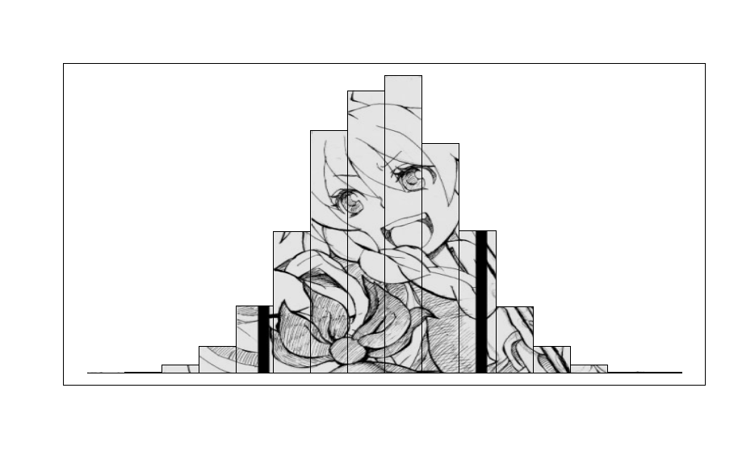
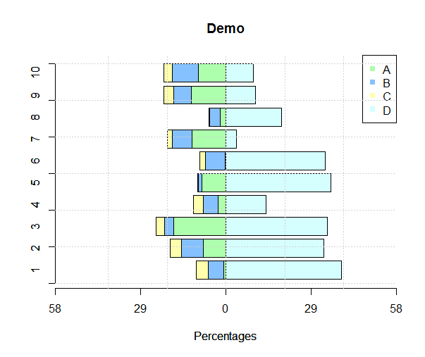
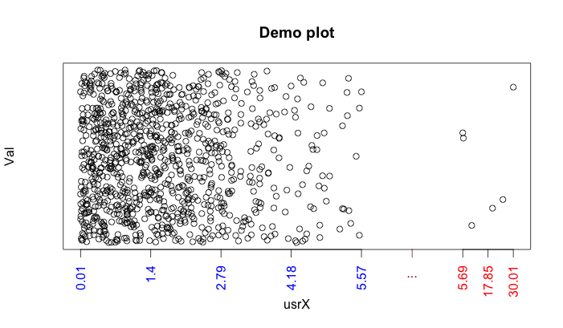

R-example
=========

Programming skills in R

1. ```euler16_use_ARRAY.R``` The power of **array**. Use integer array to calculate $a^n$ ```power(a,n)```.
2. ```outer3_use_Vectorized.R``` How to use ***Vectoriz***?
3. ```char_Split.R``` How to use (1) ```strsplit``` (2) pattern match.
4. ```CharMat_SetLocale.R``` (1) Uses utf-8 in R-studio; (2) The idea is from a renren post.
5. ```Rmd_Tab_Proctoring.Rmd``` Shows the way to use css in Rmd.
6. ```cchist_PLOT.R ``` shows an interesting histogram using other jpg as background. The idea is from internet. As a touhou fan, I used a touhou picture. Check appendix for demo output.
7. ```barplot_stackbar.R``` gives an example to create complicated bar plot. Check appendix for demo output.
8. cc's deGPS <a href="https://code.google.com/p/degps-rna-seq/"></a>.     
9. `yyPLOT_autoadj.R` Will automatically adjust the x-axis.


Appendix
=======

cchist output
-------
| Original  | After |
|:---------:|:-----:|
|  |  |   

barplot
-----


yyPLOT_autoadj output
---------

