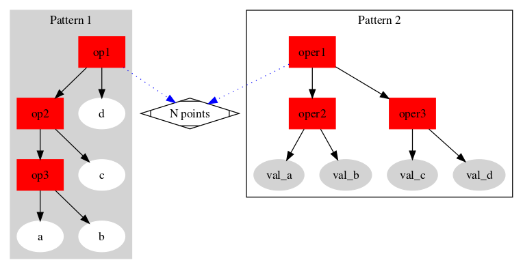
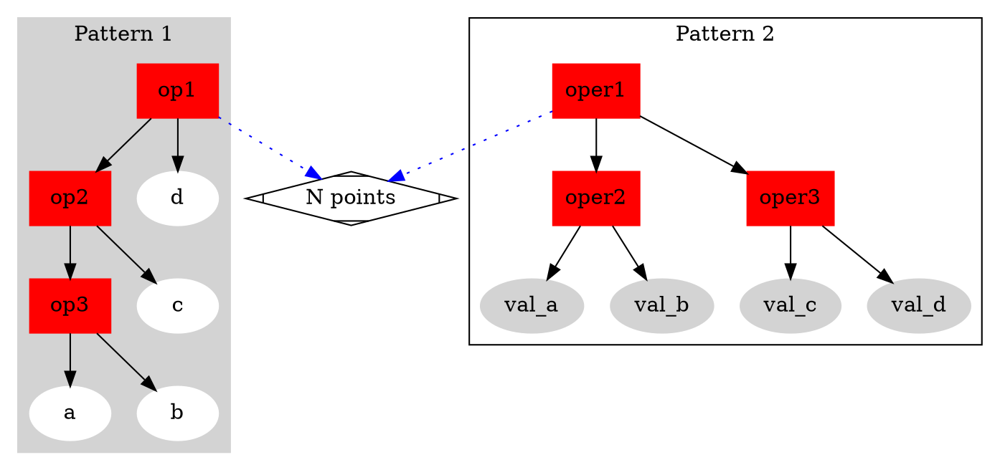

# Methods

Assume we have four positive integers a,b,c,d, the task is to use `(,),+-*/floor` to get 24. Every number should be used and used only once.

## R routine

R is likely to be a **functional program**, which could use trich like `lisp` or `scheme`. I don't mean to write something like

```scheme
(+ (+ a b) (* c d))
```

Here it is actually: `(a+b)+(c*d)`

But we could use similar structure shown in 

.

Check [src](./twe4.R).

This is a much interesting version(like scheme macro) [src2](./twe4[2].R)

I used the same data structure

```r
c("Patten","Op1","Op2","Op3",letters[1:4])
```

, which could be used to generate/parsing 

```r
# pat 1
op1(op2(a,b),op3(c,d))
# par 2
"op3"("op2"("op1"(a,b),c),d)
#i.e.
((a op1 b) op2 c) op3 d
```

# Appendix

## HOWTO: pandoc markdown with line number

```bash
pandoc --highlight-style tango --listings -H ./templateSyn.tex Readme.md -o Readme.pdf
```


## dots file


